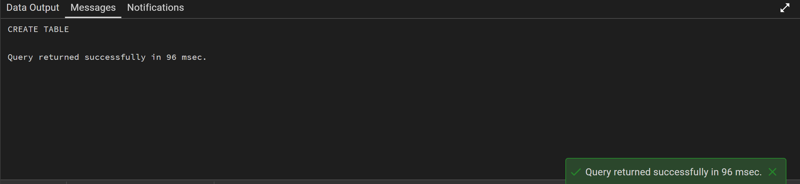
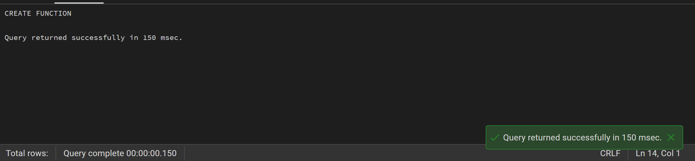
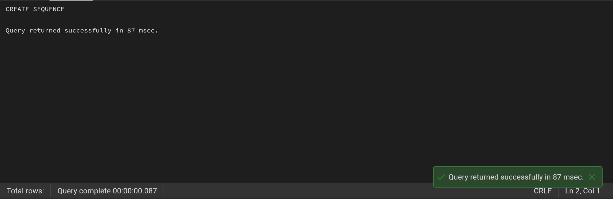
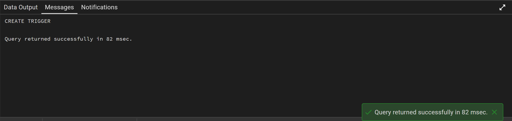
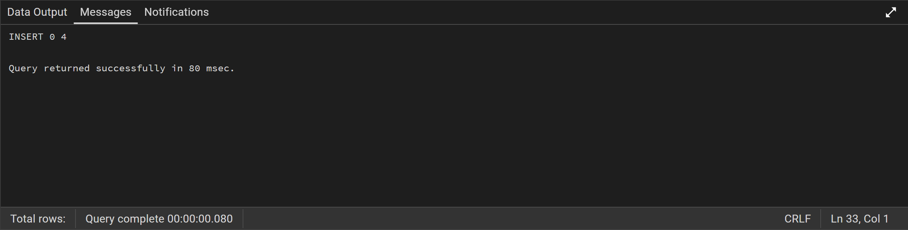
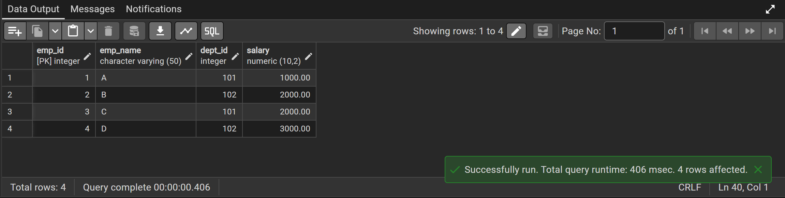

# Experiment 9

## Aim

To understand and implement database triggers in PostgreSQL to automate data validation and computational logic, ensuring data integrity by enforcing business rules during DML operations.

---

## Objectives

* To create a trigger function that performs automatic calculations on row-level data.
* To define a BEFORE INSERT trigger that intercepts data entry for validation.
* To implement custom exception handling using the RAISE EXCEPTION command.
* To verify trigger behaviour by testing both valid and invalid data scenarios within a transaction.

---

## Practical / Experiment Steps

* **Schema Provisioning:** Established the employee table with dedicated columns for base data (working hours and hourly rate) along with a computed column for the final payable amount.
* **Trigger Function Development:** Developed a PL/pgSQL function to dynamically compute total payable amount using input values.
* **Automated Validation Logic:** Integrated conditional checks to restrict insertion of records where computed amount exceeds a defined threshold.
* **Trigger Binding:** Configured a row-level trigger to execute before INSERT operations.
* **Operational Testing:** Simulated multiple insertion scenarios to validate both successful and failed transactions.

---

## Procedure

1. Accessed PostgreSQL environment and created the employee table structure.
2. Defined a trigger function to calculate total payable amount using incoming row data.
3. Embedded logic to automatically populate the computed column.
4. Applied validation rules to restrict entries exceeding the allowed limit.
5. Created a BEFORE INSERT trigger for row-level execution.
6. Executed test cases for valid data to confirm successful insertion.
7. Verified computed values using SELECT queries.
8. Tested invalid cases exceeding threshold limits.
9. Captured system-generated error messages and confirmed rejection of invalid records.

---

## I/O Analysis

### Case 1: Table Creation

* **Input:** Creation of employee table structure.
* **Output:** Table successfully created.

### Case 2: Trigger Function Creation

* **Input:** Definition of trigger function for calculation and validation.
* **Output:** Function created successfully.

### Case 3: Trigger Creation

* **Input:** Binding trigger to employee table before INSERT operations.
* **Output:** Trigger created successfully.

### Case 4: Valid Data Insertion

* **Input:** Insert operation with calculated amount within permissible limit.
* **Output:** Record inserted successfully with auto-calculated payable amount.

### Case 5: Invalid Data Insertion

* **Input:** Insert operation where computed amount exceeds threshold.
* **Output:** Exception raised and record insertion blocked.

---

## Images

---

## Learning Outcomes

* **Trigger Lifecycle Mastery:** Understanding BEFORE vs AFTER triggers and row-level execution.
* **Automated Data Calculation:** Using triggers to reduce dependency on application-side logic.
* **Custom Constraint Enforcement:** Implementing complex validation rules beyond basic constraints.
* **Error Handling:** Effectively using exception handling mechanisms to ensure data integrity.

---

## Conclusion

This experiment demonstrated how triggers can be used to automate calculations and enforce business rules within a PostgreSQL database. By integrating validation logic directly into the database layer, data integrity is maintained and application complexity is reduced. The use of exception handling further ensures that invalid transactions are effectively prevented.
