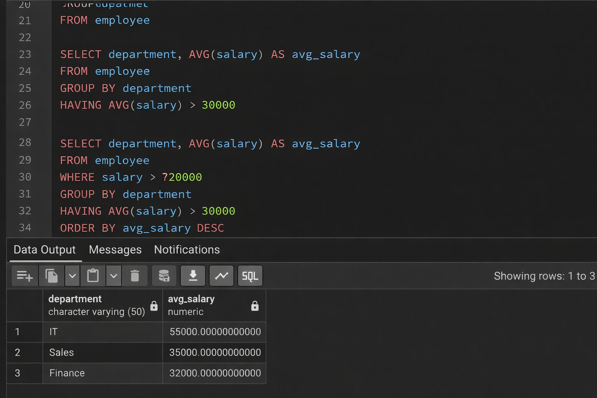
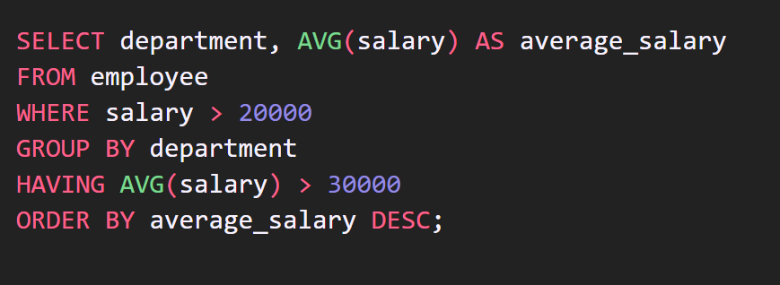

# Experiment 1.2 – SQL SELECT Queries Using Clauses

## Objective
The objective of this experiment is to understand and implement SQL SELECT queries using various clauses such as WHERE, GROUP BY, HAVING, and ORDER BY to retrieve and analyze data from a relational database.

---

## Practical / Experiment Steps
- Create an EMPLOYEE table with required fields.
- Insert sample employee records into the table.
- Apply filtering using the WHERE clause.
- Group employee records using GROUP BY.
- Calculate average salary using aggregate functions.
- Filter grouped data using HAVING.
- Sort the final result using ORDER BY.

---

## Procedure of the Experiment
1. Start the system and log in.
2. Open PostgreSQL using pgAdmin.
3. Connect to the required database.
4. Create the EMPLOYEE table.
5. Insert sample records into the table.
6. Write the SQL query using WHERE, GROUP BY, HAVING, and ORDER BY clauses.
7. Execute the query.
8. Verify the output obtained.
9. Take screenshots for record.

---

## Input / Output Details

### Input
- EMPLOYEE table containing employee details such as emp_id, emp_name, department, salary, and joining_date.
- Salary condition: salary greater than 20,000.

### Output
- Department-wise average salary.
- Only departments with average salary greater than 30,000.
- Result sorted in descending order of average salary.

---

## Learning Outcome
After completing this experiment, the student is able to:
- Filter records using the WHERE clause.
- Group records using GROUP BY.
- Apply conditions on grouped data using HAVING.
- Sort results using ORDER BY.
- Use aggregate functions for data analysis.

---

