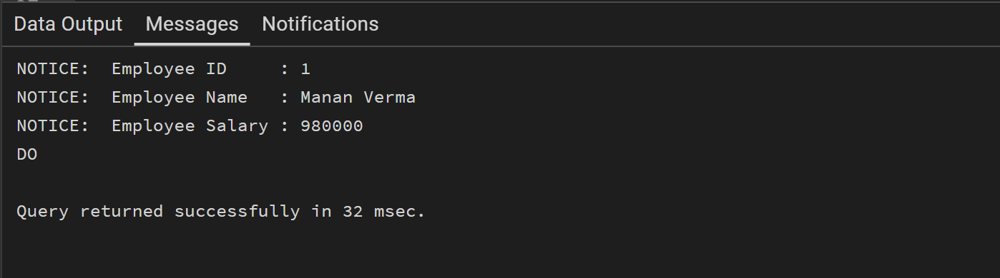
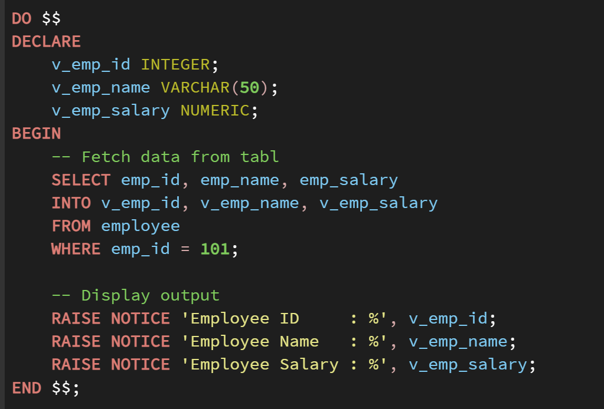
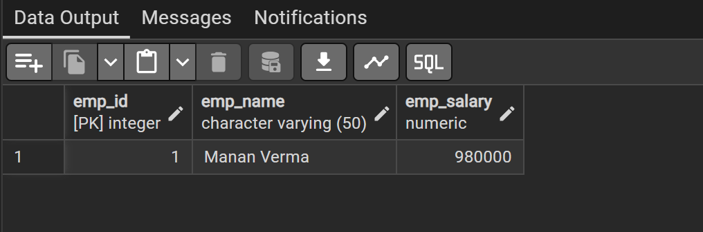
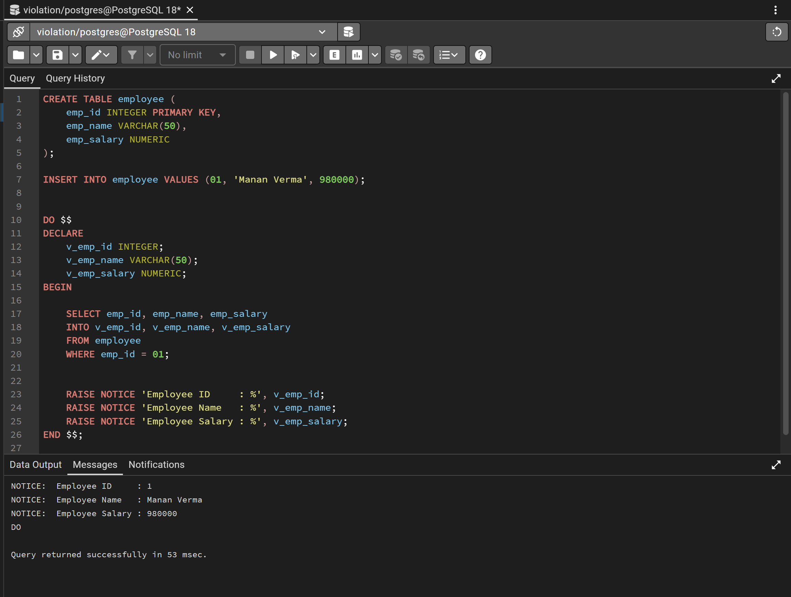

# Experiment 3 – Basic Structure of a PL/SQL Program (PL/pgSQL)

## Objective
The objective of this experiment is to understand the basic structure of a PL/SQL program by creating and executing a simple PL/pgSQL block that includes declaration and execution sections, and to display output using built-in procedures in PostgreSQL.

---

## Practical / Experiment Steps
- Create an EMPLOYEE table with required fields.
- Insert sample employee records into the table.
- Write a PL/pgSQL block with a declaration section.
- Retrieve employee details into variables.
- Display output using built-in output statements.
- Execute the PL/pgSQL block in PostgreSQL.

---

## Procedure of the Experiment
1. Start the system and log in.
2. Open PostgreSQL using pgAdmin.
3. Connect to the required database.
4. Create the EMPLOYEE table.
5. Insert sample records into the table.
6. Write a PL/pgSQL block using `DECLARE` and `BEGIN...END` sections.
7. Execute the PL/pgSQL block.
8. Verify the output obtained.
9. Take screenshots for record.

---

## Input / Output Details

### Input
- EMPLOYEE table containing employee details such as `emp_id`, `emp_name`, and `emp_salary`.
- Sample employee data inserted into the table.

### Output
- Display of employee ID.
- Display of employee name.
- Display of employee salary using built-in output procedure.

### Screenshots

---

## Learning Outcome
After completing this experiment, the student is able to:
- Understand the structure of a PL/SQL-style block.
- Declare and initialize variables in PL/pgSQL.
- Retrieve data from database tables into variables.
- Display output using built-in PostgreSQL procedures.
- Execute procedural SQL blocks in PostgreSQL.
