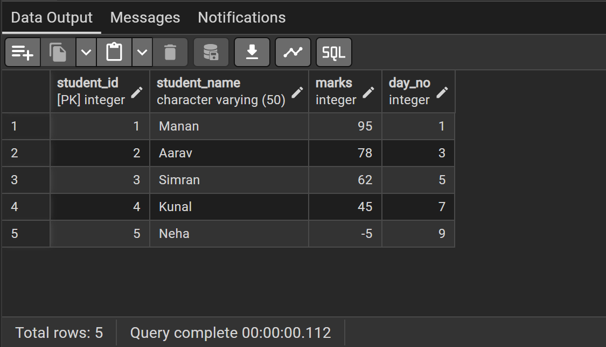
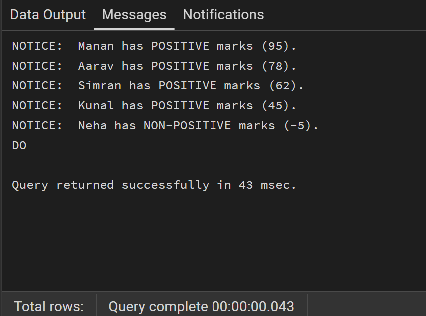
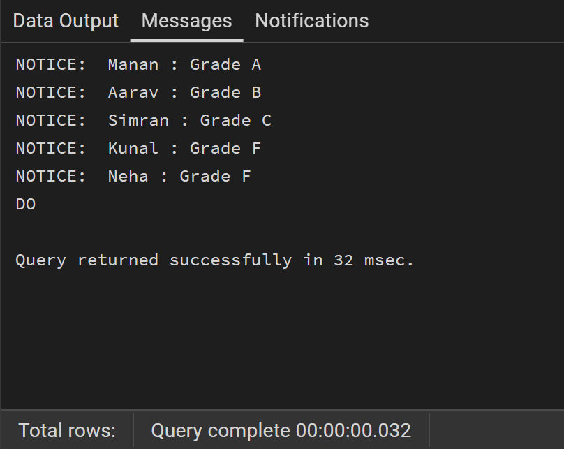
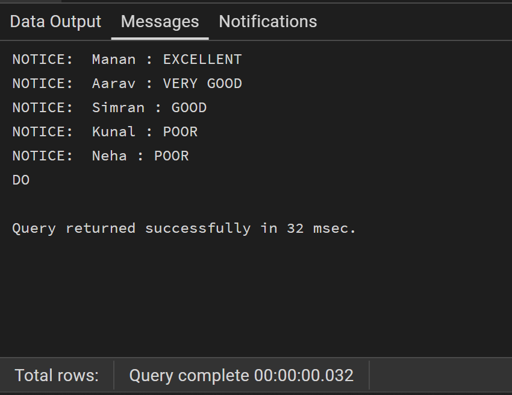
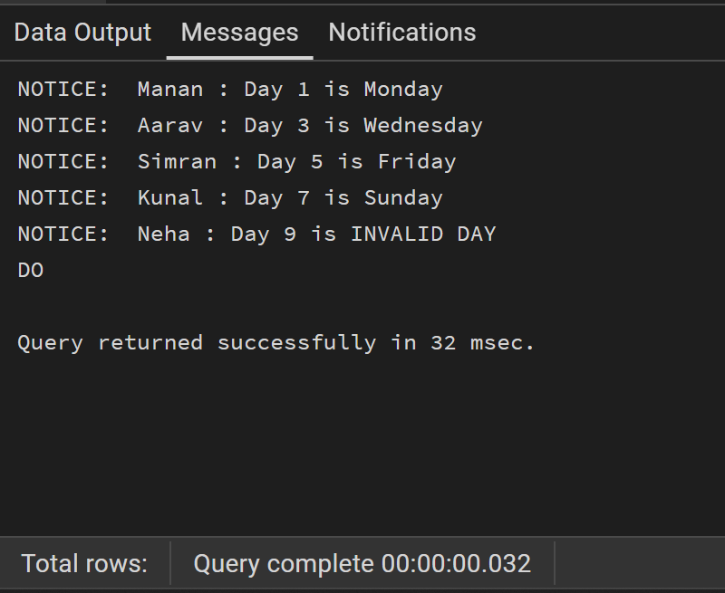
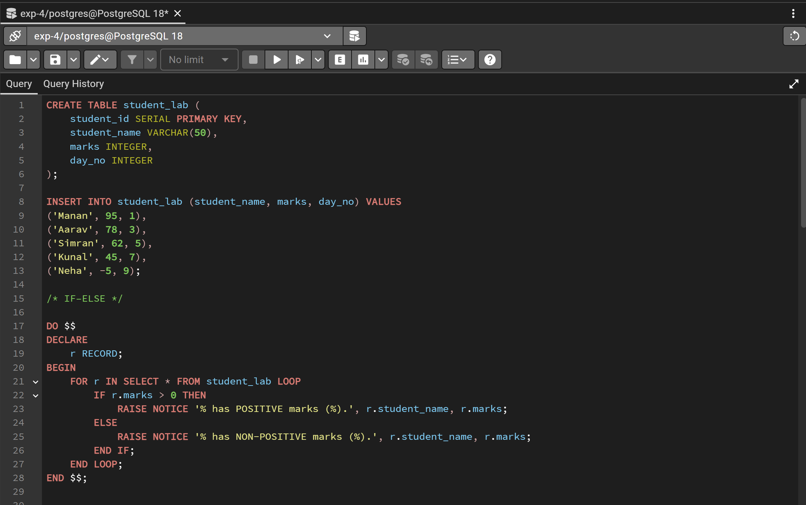
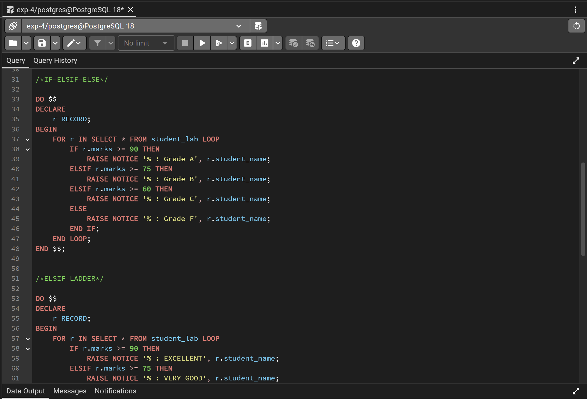
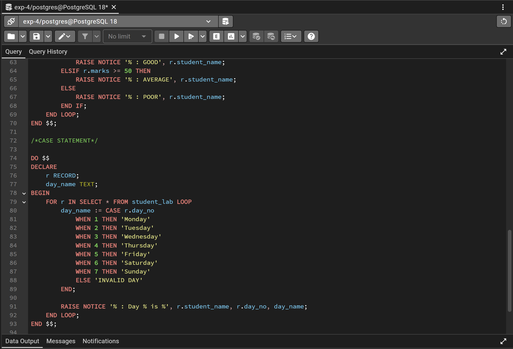

# Experiment 4 – Conditional Control Statements in PL/pgSQL

## Objective
The objective of this experiment is to understand and implement conditional control statements in PL/pgSQL, such as IF–ELSE, IF–ELSIF–ELSE, ELSIF ladder, and CASE statements, in order to control the flow of execution based on logical conditions.

---

## Practical / Experiment Steps
- Create a single database table to store student-related data.
- Insert sample records into the table.
- Write PL/pgSQL blocks demonstrating conditional control statements.
- Implement IF–ELSE statement to check conditions.
- Implement IF–ELSIF–ELSE statement for decision making.
- Implement ELSIF ladder for multiple condition evaluation.
- Implement CASE statement for selection-based execution.
- Execute the PL/pgSQL blocks in PostgreSQL.

---

## Procedure of the Experiment
1. Start the system and log in.
2. Open PostgreSQL using pgAdmin.
3. Connect to the required database.
4. Create a table for storing student information.
5. Insert sample data into the table.
6. Write PL/pgSQL blocks using conditional control statements.
7. Execute each PL/pgSQL block separately.
8. Observe the output messages generated.
9. Take screenshots for record.

---

## Input / Output Details

### Input
- A database table containing student details such as:
  - Student ID
  - Student Name
  - Marks
  - Day Number
- Sample records inserted into the table.

### Output
- Display whether marks are positive or non-positive using IF–ELSE.
- Display student grade based on marks using IF–ELSIF–ELSE.
- Display performance status using ELSIF ladder.
- Display day name based on day number using CASE statement.

### Screenshots

---

## Learning Outcome
After completing this experiment, the student is able to:
- Understand conditional control statements in PL/pgSQL.
- Implement IF–ELSE and IF–ELSIF–ELSE statements.
- Apply ELSIF ladder for evaluating multiple conditions.
- Use CASE statements for selection-based execution.
- Control the flow of execution in PL/pgSQL blocks.
- Execute and analyze procedural SQL programs in PostgreSQL.
