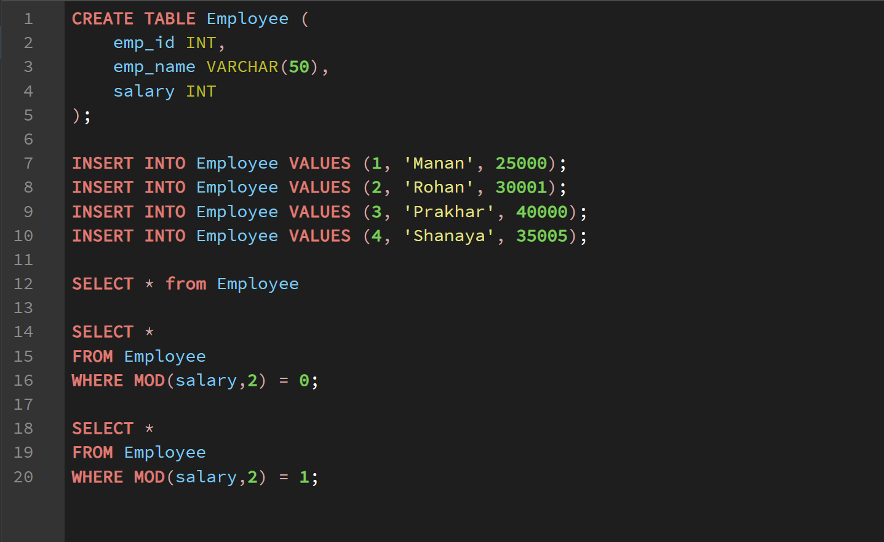
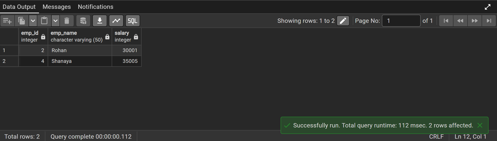
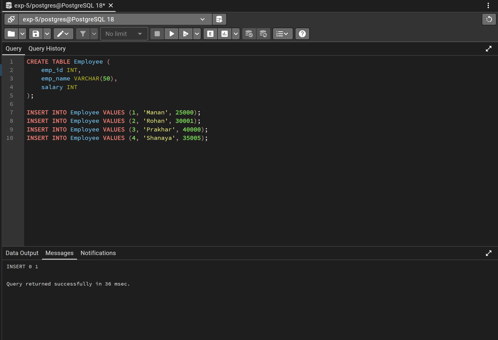
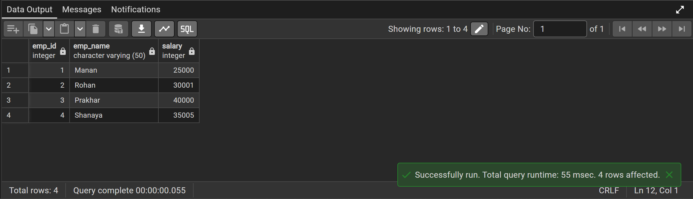

# Experiment 5 –SQL Conditional Logic (Odd & Even Values)

## Objective
The objective of this experiment is to understand and apply conditional logic in SQL using the MOD (%) operator to identify and classify employee salaries as odd or even, helping in basic numerical data analysis within a database.

---

## Practical / Experiment Steps
Create a database table to store employee details.

Insert sample records into the employee table.

Write SQL queries using the MOD (%) operator.

Identify employees whose salaries are even numbers.

Identify employees whose salaries are odd numbers.

Execute the SQL queries in PostgreSQL.

Observe and verify the output results.

---

## Procedure of the Experiment
Start the system and log in.

Open PostgreSQL using pgAdmin.

Connect to the required database.

Create an Employee table.

Insert sample employee records.

Write SQL queries using the MOD operator.

Execute queries to find even salaries.

Execute queries to find odd salaries.

Observe the results and take screenshots for documentation.
---

## Input / Output Details

### Input
A database table containing employee details such as:

Employee ID

Employee Name

Salary

Sample salary values inserted into the table.

### Output
-Display employees whose salary is even using the MOD operator.

Display employees whose salary is odd using the MOD operator.

### Screenshots

---

## Learning Outcome
After completing this experiment, the student is able to:

Understand the use of the MOD (%) operator in SQL.

Apply conditional logic in SQL queries.

Differentiate between odd and even numeric values in a database.

Retrieve filtered data using conditional SQL statements.

Perform simple data analysis using SQL queries.