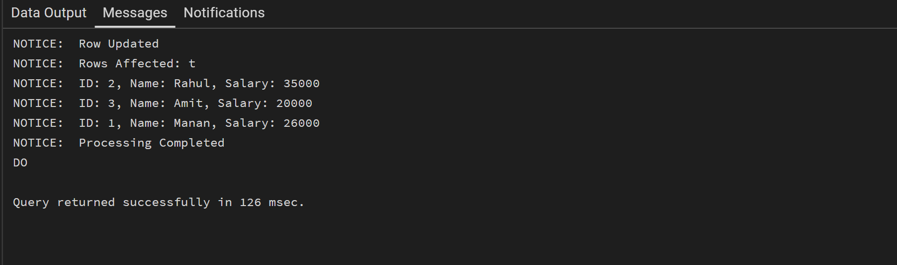
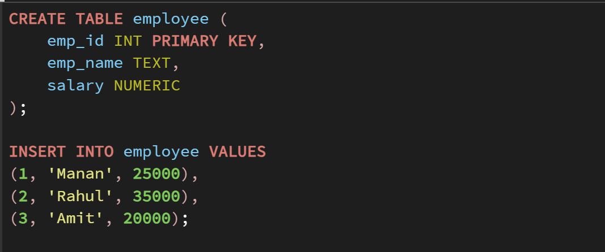
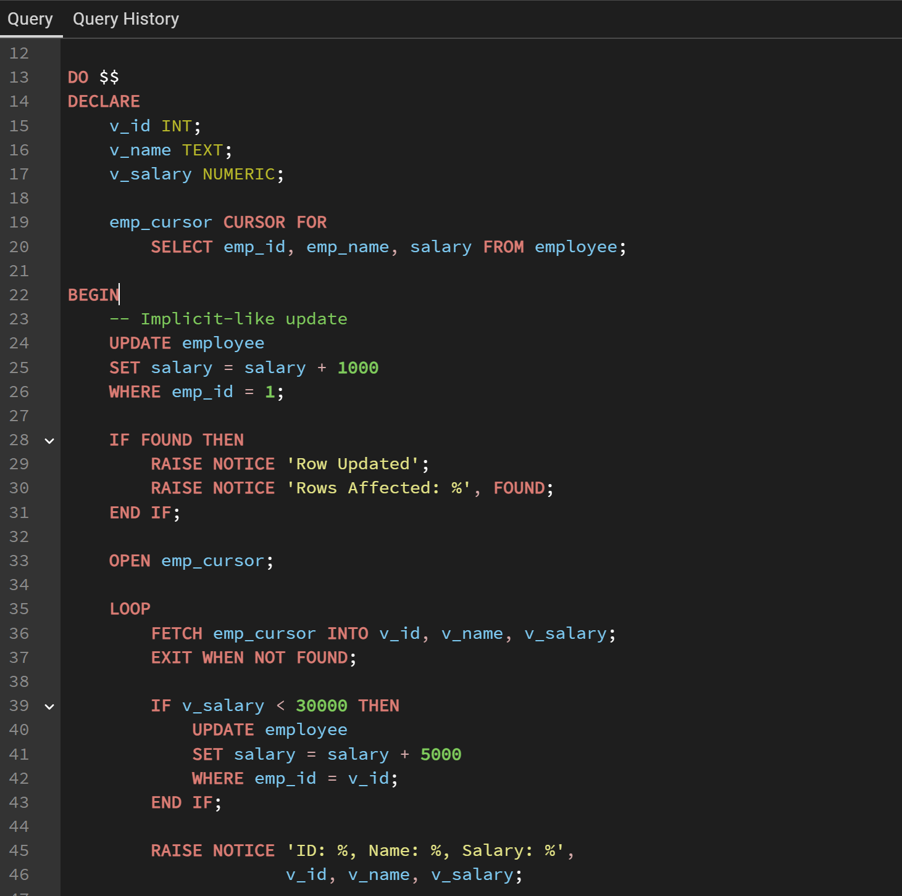
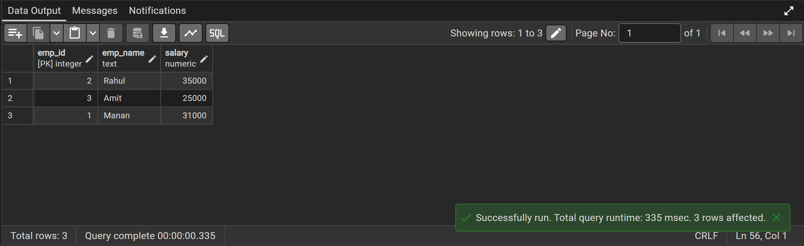

# Experiment 6

## Objective
The objective of this experiment is to understand and implement cursors in PL/SQL for processing multiple rows individually, and to apply business logic using implicit cursors, explicit cursors, and cursor attributes.

---

## Practical / Experiment Steps
Create a database table to store employee details.

Insert sample records into the employee table.

Write PL/SQL code using implicit cursors for DML operations.

Declare and use explicit cursors to fetch multiple records.

Apply business logic to each row (e.g., salary increment).

Use cursor attributes such as %FOUND, %NOTFOUND, %ROWCOUNT, %ISOPEN.

Execute the PL/SQL program in Oracle SQL Developer.

Observe and verify the output.

## Procedure of the Experiment
Start the system and log in.

Open Oracle SQL Developer.

Connect to the Oracle XE database.

Create an Employee table.

Insert sample employee records.

Write PL/SQL block using implicit cursor.

Write PL/SQL block using explicit cursor.

Execute the program.

Observe results using DBMS_OUTPUT.

Take screenshots for documentation.
---

## Input / Output Details

### Input
A database table containing employee details such as:

Employee ID

Employee Name

Salary

Sample salary values inserted into the table.

### Output
Display employee records processed using cursors.

Display updated salary values after applying business logic.

Show messages using cursor attributes such as rows processed and status.

### Screenshots

---

## Learning Outcome
After completing this experiment, the student is able to:

Understand the concept of cursors in PL/SQL.

Differentiate between implicit and explicit cursors.

Use cursor attributes effectively.

Process multiple records row by row.

Apply cursor-based logic in real-world database scenarios.